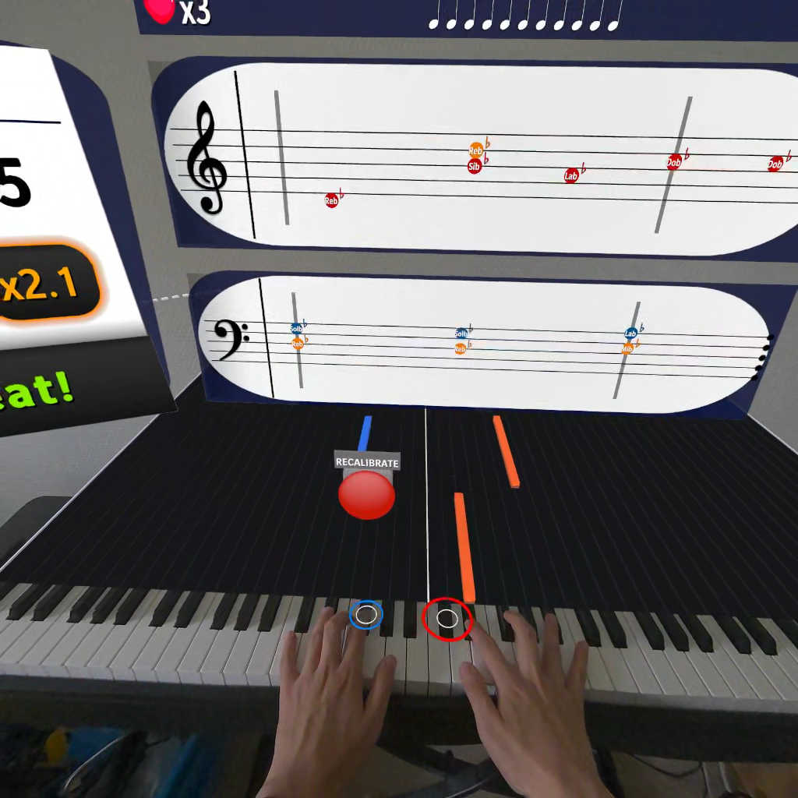
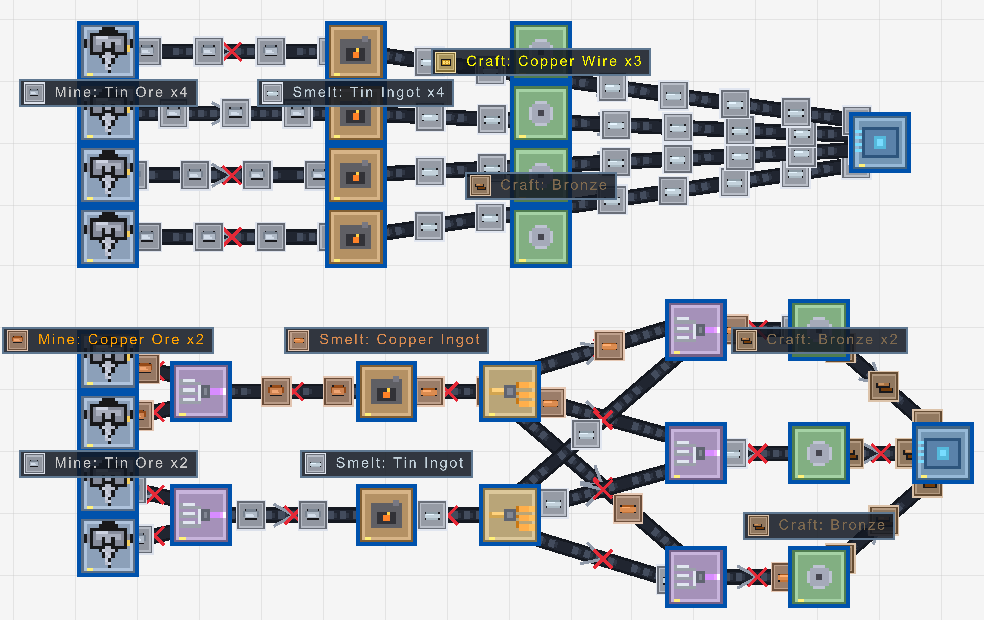
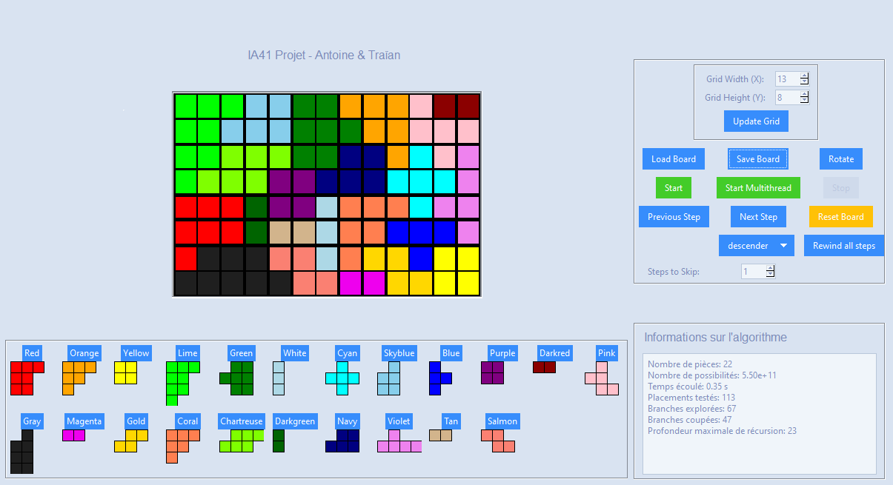
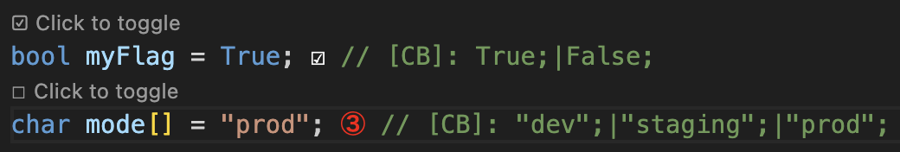
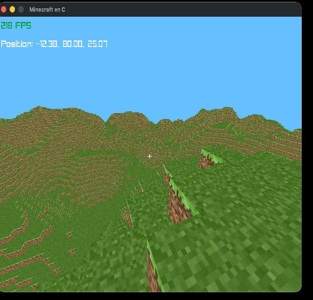
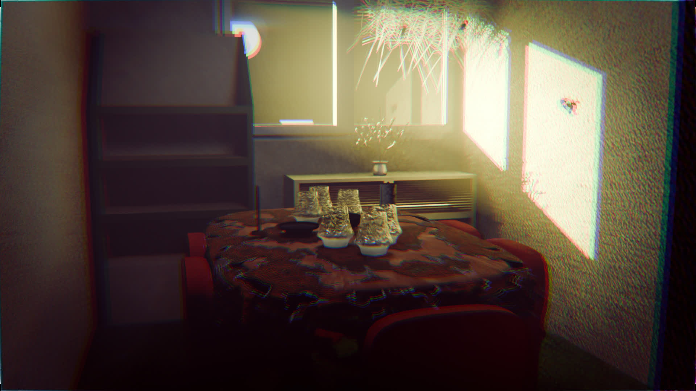

<h1 align="center">Hi 👋, I'm Antoine Perrin</h1>
<h3 align="center">A passionate Software Engineering Student</h3>

  

- Check out my projects on my [Portfolio](https://antoinep.fr/portfolio) !

- 👨‍💻 I made my own VS Code Extension to ease switching booleans/values, check it out : [Checkbox Display](https://open-vsx.org/extension/antoineperrin/checkbox-display)
or on the [Visual Studio Marketplace](https://marketplace.visualstudio.com/items?itemName=AntoinePERRIN.checkbox-display). 300+ downloads !

<h3 align="left">Featured Projects</h3>

<!-- Assets: public/img/ → https://raw.githubusercontent.com/AntoinePerrin25/AntoinePerrin25/refs/heads/main/public/img/ -->

<h4 align="left">ClaviAR — Mixed Reality Piano Calibration</h4>

Meta Quest piano prototype with ~3-second automatic keyboard calibration, procedural exercises, and a rhythm-game demo loop.

  <video src="./public/img/claviar/claviar_preview.mp4" controls width="80%"></video>

  

<h4 align="left">Node Factory</h4>

Factory automation game in C and Raylib — place nodes, route belts, fulfill hub quests, and play scenario-driven progression.

  

<h4 align="left"><a href="https://github.com/AntoinePerrin25/iq-solver-pro-ai-resolver">IQ Puzzler Pro Solver</a></h4>

Solver for the IQ Puzzler Pro game using Knuth's Algorithm X with optimizations.

  

<h4 align="left"><a href="https://marketplace.visualstudio.com/items?itemName=AntoinePERRIN.checkbox-display">Checkbox Display</a></h4>

VS Code and Eclipse extension — interactive checkboxes in source files and notebooks with explorer, CodeLens, and carousel values.

  

<h4 align="left"><a href="https://github.com/AntoinePerrin25/minecraft">Minecraft (C / Raylib)</a></h4>

Voxel game in C with Raylib — terrain chunks, first-person controls, and multiplayer. Cross-platform Makefile build.

  

<h4 align="left">Blender Scene</h4>

Apartment recreation in Blender from reference photos — geometry nodes for furniture, Python space-invasion tree generation.

  

<h3 align="left">Languages and Tools:</h3>
<h4 align="left">Favorite</h4>

  
  <a href="https://www.postgresql.org" target="_blank" rel="noreferrer"> 
    

<h4 align="left">Web Development</h4>

  
  
   

<h4 align="left">Others</h4>

       </a>    

<picture>
  <source media="(prefers-color-scheme: dark)" srcset="https://raw.githubusercontent.com/AntoinePerrin25/AntoinePerrin25/output/pacman-contribution-graph-dark.svg">
  <source media="(prefers-color-scheme: light)" srcset="https://raw.githubusercontent.com/AntoinePerrin25/AntoinePerrin25/output/pacman-contribution-graph.svg">
  
</picture>
